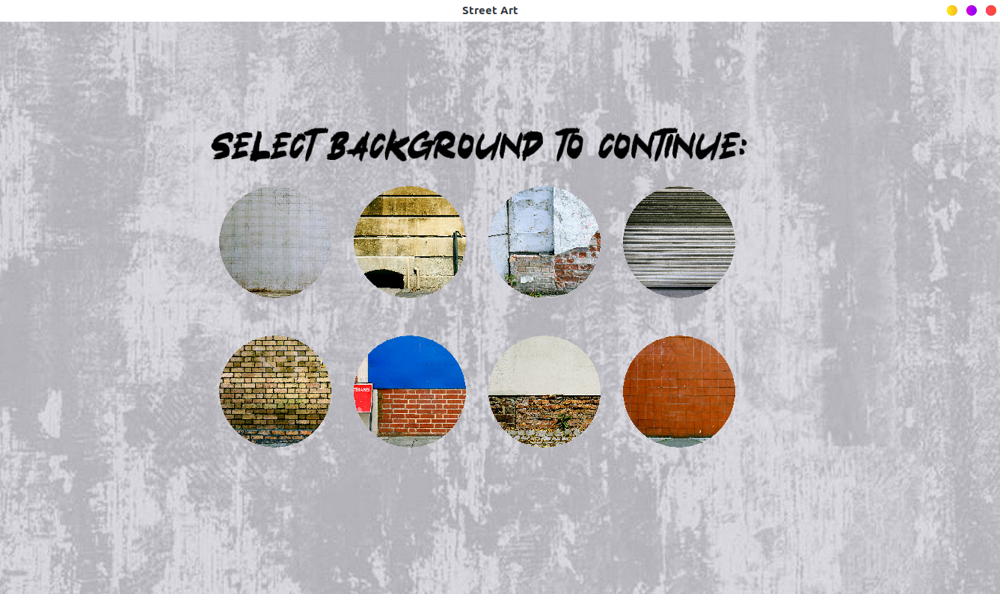
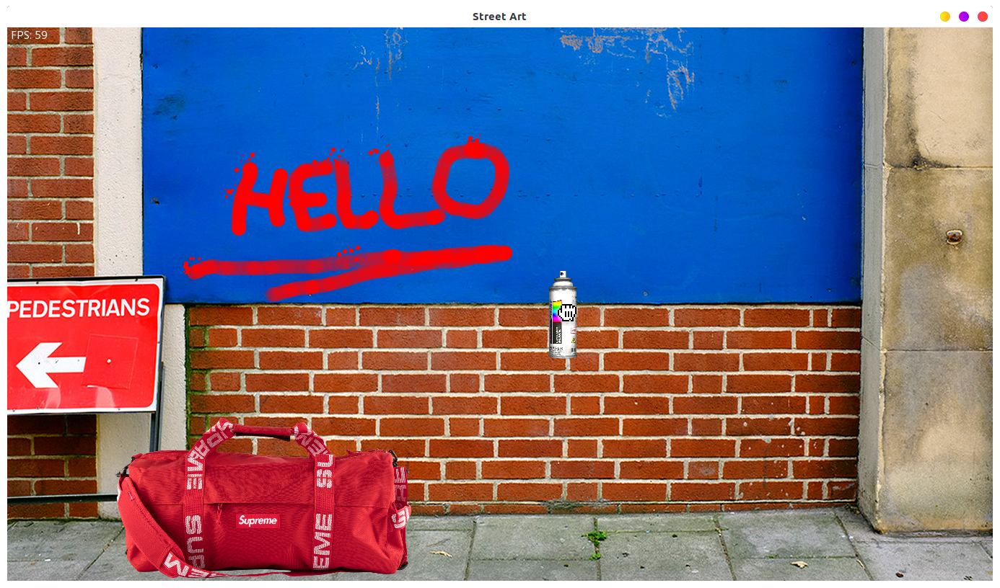

# JAM_streetart_2019

This is my GameJam done with [Valentinbreiz](https://github.com/valentinbreiz).

Theme of the Jam: **StreetArt**

## Prerequisites

- SFML library

```bash
sudo apt-get install libsfml-dev
```

## Run

Compile the project
```bash
make
```

Exec binary
```
./streetart
```

## Game description
In this game you can grab a spray paint can and draw some grafitti tag on walls




